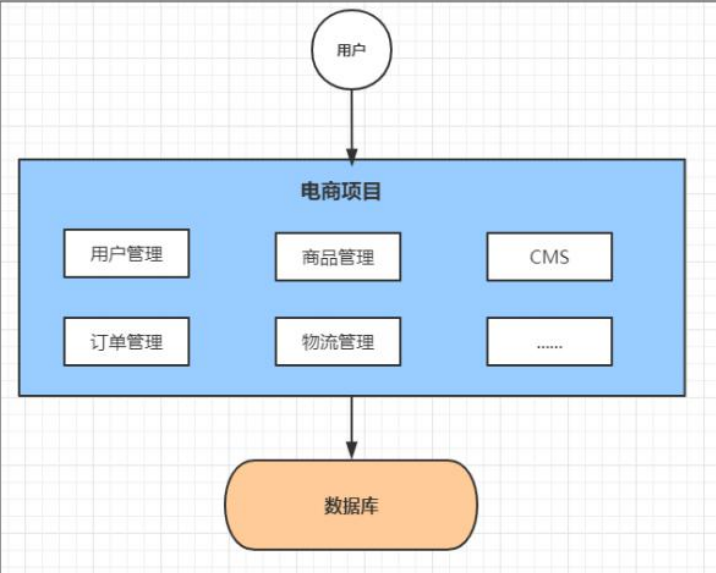

# 单体应用架构

互联网早期，一般的网站应用流量较小，只需一个应用，将所有功能代码都部署在一起就可以，这样可以减少开发、部署和维护的成本。

比如说一个电商系统，里面会包含很多用户管理，商品管理，订单管理，物流管理等等很多模块，我们会把它们做成一个web项目，然后部署到一台tomcat服务器上。

\

优点:

\

\- 项目架构简单，小型项目的话，开发成本低项目部署在一个节点上，维护方便

\

缺点:

\

\- 全部功能集成在一个工程中，对于大型项目来讲不易开发和维护项目模块之间紧密耦合，单点容错率低

\

\- 无法针对不同模块进行针对性优化和水平扩展

